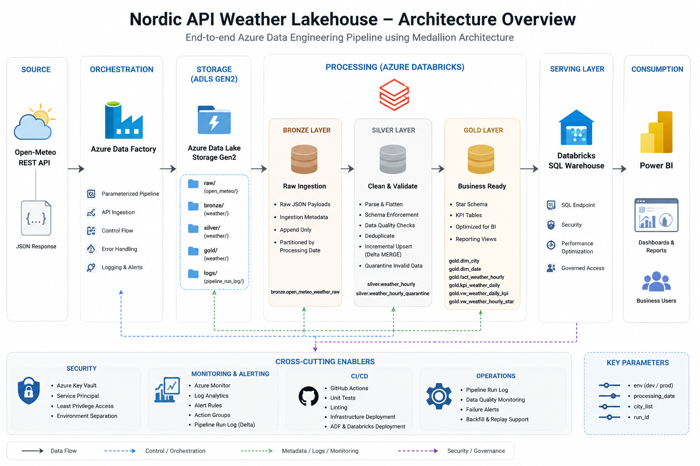

# Nordic API Weather Lakehouse

<p align="left">


</p>

End-to-end Azure Data Engineering project using a real REST API and a production-like cloud-native architecture.

---

# Project Goal

This project demonstrates a modern Azure Data Engineering platform built using cloud-native services and scalable lakehouse architecture patterns.

The solution ingests hourly weather data from a real REST API, stores raw payloads in Azure Data Lake Storage Gen2, processes the data through Bronze, Silver and Gold layers using Databricks and Delta Lake, and serves analytical datasets to Power BI through Databricks SQL Warehouse.

The project is designed to simulate a real-world enterprise data platform with orchestration, monitoring, security and CI/CD practices.

---

# Architecture



---

# Key Features

- REST API ingestion using Azure Data Factory
- Parameterized and reusable pipelines
- Medallion Architecture implementation
- Incremental processing using Delta MERGE / UPSERT
- Data quality validation and quarantine handling
- Delta Lake transactional storage
- Star schema modeling for analytics
- KPI table generation for BI dashboards
- Databricks SQL Warehouse serving layer
- Power BI integration
- Secure secret management using Azure Key Vault
- Service Principal authentication
- Monitoring and alerting using Azure Monitor and Log Analytics
- CI/CD automation using GitHub Actions

---

# Technology Stack

| Category             | Technology                    |
| -------------------- | ----------------------------- |
| Cloud Platform       | Microsoft Azure               |
| Orchestration        | Azure Data Factory            |
| Storage              | Azure Data Lake Storage Gen2  |
| Processing Engine    | Azure Databricks              |
| Data Processing      | PySpark                       |
| Lakehouse Format     | Delta Lake                    |
| Architecture Pattern | Medallion Architecture        |
| Analytics Layer      | Databricks SQL Warehouse      |
| Reporting            | Power BI                      |
| Secret Management    | Azure Key Vault               |
| Monitoring           | Azure Monitor + Log Analytics |
| CI/CD                | GitHub Actions                |
| Language             | Python + SQL                  |

---

# Data Source

The project uses the Open-Meteo REST API to ingest historical and hourly weather observations for selected Swedish cities.

## Example Cities

| City      | Country |
| --------- | ------- |
| Stockholm | Sweden  |
| Göteborg  | Sweden  |
| Malmö     | Sweden  |
| Uppsala   | Sweden  |

---

# High-Level Architecture

```text
Open-Meteo REST API
        |
        | Daily parameterized ingestion
        v
Azure Data Factory
        |
        | Store raw JSON payloads
        v
Azure Data Lake Storage Gen2
        |
        | Bronze ingestion notebooks
        v
Azure Databricks - Bronze Layer
        |
        | Cleaning, validation and flattening
        v
Azure Databricks - Silver Layer
        |
        | KPI generation and star schema
        v
Azure Databricks - Gold Layer
        |
        | SQL serving layer
        v
Databricks SQL Warehouse
        |
        | Semantic reporting
        v
Power BI
```

---

# Medallion Architecture

The platform follows the Medallion Architecture design pattern.

## Bronze Layer

Stores raw API payloads with minimal transformation.

### Responsibilities

- Preserve source data
- Store ingestion metadata
- Support replay and backfill
- Maintain append-only history

---

## Silver Layer

Stores cleaned, validated and deduplicated weather observations.

### Responsibilities

- Parse and flatten JSON payloads
- Apply schema enforcement
- Run data quality checks
- Quarantine invalid records
- Perform incremental upserts

---

## Gold Layer

Stores business-ready analytical datasets optimized for reporting and BI workloads.

### Responsibilities

- Create dimensional models
- Build KPI tables
- Optimize analytical queries
- Expose reporting views

---

# Data Model

## Core Tables

### Bronze

```text
bronze.open_meteo_weather_raw
```

### Silver

```text
silver.weather_hourly
silver.weather_hourly_quarantine
```

### Gold

```text
gold.dim_city
gold.dim_date
gold.fact_weather_hourly
gold.kpi_weather_daily
```

---

# Incremental Processing Strategy

## Bronze

- Append-only ingestion
- Partitioned by processing date

## Silver

- Delta MERGE based incremental upserts
- Deduplication using surrogate hash keys

## Gold

- Rebuild only affected business dates
- Optimized KPI refresh strategy

---

# Data Quality Rules

The Silver layer applies validation checks including:

- Null checks
- Range validations
- Timestamp validation
- Duplicate detection
- Quarantine routing for invalid records

Example rules:

| Column               | Validation                 |
| -------------------- | -------------------------- |
| temperature_2m       | Between -60 and 60         |
| relative_humidity_2m | Between 0 and 100          |
| precipitation_mm     | Greater than or equal to 0 |
| wind_speed_10m       | Greater than or equal to 0 |

---

# Security Design

The project follows enterprise-style security practices.

## Security Features

- No secrets stored in code
- Azure Key Vault integration
- Service Principal authentication
- Least privilege access model
- Environment separation between dev and prod
- Power BI access restricted to Gold views only

---

# Monitoring and Alerting

Operational monitoring is implemented using:

- Azure Data Factory Monitoring
- Azure Monitor
- Log Analytics Workspace
- Delta-based operational logging
- Alert rules and notification groups

## Operational Log Table

```text
ops.pipeline_run_log
```

Tracked metrics include:

- Pipeline status
- Record counts
- Failed validations
- Processing timestamps
- Error messages

---

# CI/CD

GitHub Actions is used for automated deployment and validation workflows.

## CI/CD Responsibilities

- Validate repository structure
- Run automated tests
- Lint Python code
- Deploy infrastructure assets
- Deploy Databricks notebooks
- Deploy SQL artifacts
- Deploy Azure Data Factory pipelines

---

# Power BI Serving Layer

Power BI connects only to:

```text
Databricks SQL Warehouse
```

Power BI does not connect directly to:

- Bronze tables
- Silver tables
- ADLS files

This architecture improves:

- Governance
- Security
- Query optimization
- Semantic consistency

---

# Future Improvements

Potential future enhancements:

- Near real-time streaming ingestion
- Infrastructure as Code with Terraform
- Unity Catalog integration
- Automated data lineage
- Great Expectations data quality framework
- dbt transformation layer
- ML-based weather anomaly detection

---

# License

This project is licensed under the MIT License.
